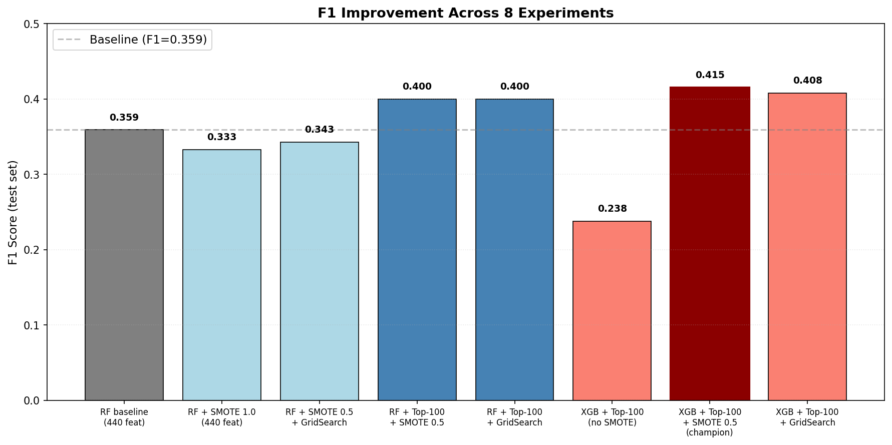
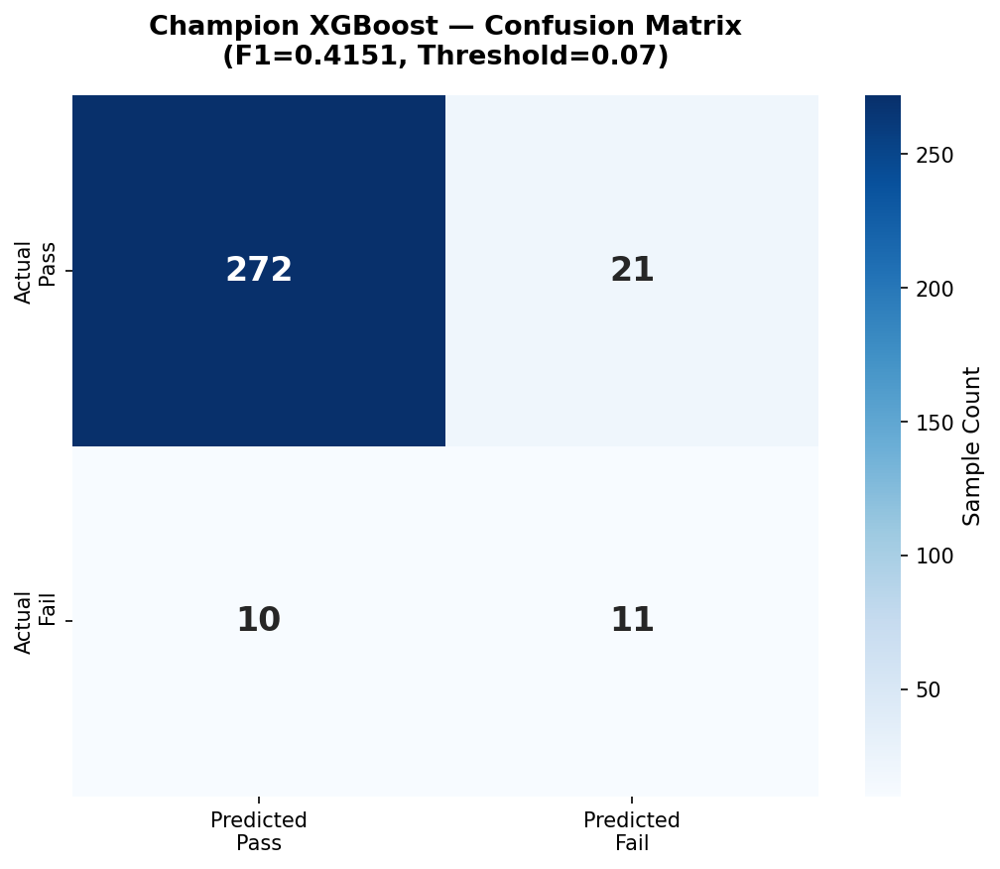
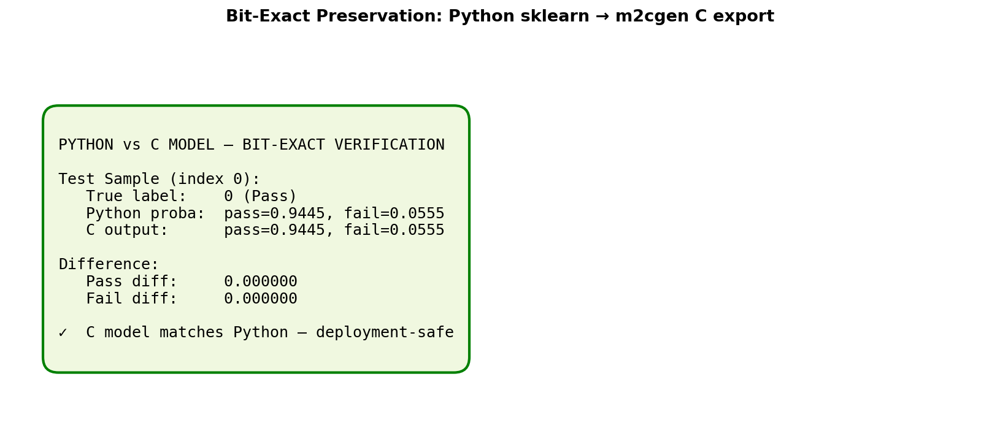

### 4.1 Dataset and Problem Framing

The model is trained on UCI SECOM dataset in the development of the
predictive maintenance model. The SECOM dataset is widely used as a benchmark
in the process telemetry data of semiconductor manufacturing processes. The
dataset contains 1,567 process samples with 590 individual features capturing internal
manufacturing variables, such as a gas pressure or flow rates. A key technical
issue is that there is a severe class imbalance with only 104 failures present
compared to 1,463 passes, a mere 6.6% failure rate. This class imbalance, along
with the high dimensional features and high rate of missing values
characteristic of actual fab sensor data, adds complexity to the problem.
Despite the challenges, the SECOM dataset is a great choice for this work due
to the sparsity of defects and data complexity seen in high volume silicon
testing and post-silicon validation.

### 4.2 Preprocessing Pipeline

After
collecting, raw SECOM data is extensively preprocessed for the stability and
compatibility with the ESP32 resource constraints. Features with over 55% of
missing values are discarded and remaining null/missing values are filled using
median imputation so as not to add to the distribution of the dataset or insert
outliers. After this, a variance-based filter is used to eliminate zero or
near-zero variance predictors, removing features with variance below 1e-6,
which have negligible predictive value. This filtering is important and
decreases the number of features to 440 compared to the 590 used initially. A
train/test stratified 80/20 split is performed using a static random state for
consistent results during evaluation. This also ensures the results align with
the initial class proportions. An important architectural decision was to use
min-max scaling to scale all features to fit within the int16 boundaries (-30000,
+30000). Standard normalization using Z-scores was avoided as this feature set
would fall in the [-3, +3] range, which collapses to near zero integers when
cast to int16 in the embedded export pipeline.

### 4.3 Baseline Model Selection

For
the establishment of a performance baseline, three different model families
were tested: Random Forest (RF) which is an ensemble bagger, XGBoost (XGB)
which uses gradient boosting, and a Multi-Layer Perceptron (MLP) that
represents neural networks. To overcome the severe class imbalance of the SECOM
dataset during this initial training, class weighting was performed using class_weight='balanced'
for Random Forest, and scale_pos_weight was used in XGBoost to penalize
classification error for minority class. Furthermore, in place of the standard
threshold of 0.5 classification, a probability sweep ranging from 0.05 to 0.95
was carried out to find the threshold that maximized F1-score for each
candidate. Initially,
Random Forest yielded F1=0.359 at threshold 0.19, substantially better than
XGBoost (F1=0.238) and MLP (F1=0.148) on this preprocessing pipeline. Random
Forest was selected as the deployment baseline, both for its superior F1-score
and its compatibility with tree-based embedded toolchains, providing a
consistent reference for subsequent optimization experiments.

| Model         | Best Threshold | F1    | Recall | Precision | AUC   |
| ------------- | -------------- | ----- | ------ | --------- | ----- |
| Random Forest | 0.19           | 0.359 | 0.333  | 0.389     | 0.743 |
| XGBoost       | 0.05           | 0.238 | 0.238  | 0.238     | 0.735 |
| MLP*          | 0.14           | 0.148 | 0.381  | 0.092     | 0.521 |

**Table 1.** Baseline model comparison. *MLP from earlier preprocessing pipeline.

### 4.4 F1 Improvement Experimentation

With
a stable baseline in Random Forest areas of improvement were investigated. The
low prediction F1-score of 0.359 was an immediate concern since a poor
predictive capacity can reduce the benefit of predictive maintenance in the
semiconductor manufacturing environment. A rigorous experimental campaign was
conducted: eight experiments across multiple orthogonal axes: oversampling,
hyperparameters, and feature selection.

First,
SMOTE oversampling was evaluated at several levels. Results showed that
although the baseline 0.5 SMOTE oversample significantly increased recall (to
nearly 76%) it simultaneously degraded the precision resulting in too many
false alarms. Additional experiments evaluated other oversamplers such as
ADASYN and SMOTE-Tomek to try to improve the separability of the decision
boundary. However, the baseline SMOTE 0.5 sample consistently produced reliable
results across multiple model families. Feature selection experiments revealed
the highest cause of model instability in this dataset. The full 440-feature
space introduced sufficient noise to degrade most models. Selecting the Top 100
features by Gini importance achieved a better complexity/accuracy trade-off.

Finally,
multiple model families were tested against the optimised feature set,
including Logistic Regression, LightGBM, and XGBoost. The XGBoost classifier
paired with Top 100 features and SMOTE sampling_strategy=0.5 emerged as the
champion configuration: F1=0.4151 (+15.6% over baseline).

| #           | Configuration                                      | F1              | Recall | Precision | AUC   |
| ----------- | -------------------------------------------------- | --------------- | ------ | --------- | ----- |
| 1           | RF baseline (440 features)                         | 0.359           | 0.333  | 0.389     | 0.743 |
| 2           | RF + SMOTE 1.0 (440 features)                      | 0.333           | 0.762  | 0.213     | 0.785 |
| 3           | RF + SMOTE 0.5 + GridSearch                        | 0.343           | 0.571  | 0.245     | 0.801 |
| 4           | RF + Top-100 + SMOTE 0.5                           | 0.400           | 0.524  | 0.324     | 0.780 |
| 5           | RF + Top-100 + GridSearch                          | 0.400           | 0.524  | 0.324     | 0.800 |
| 6           | XGBoost + Top-100 (no SMOTE)                       | 0.238           | 0.238  | 0.238     | 0.735 |
| **7** | **XGBoost + Top-100 + SMOTE 0.5 (champion)** | **0.415** | 0.524  | 0.344     | 0.760 |
| 8           | XGBoost + Top-100 + GridSearch                     | 0.408           | 0.476  | 0.357     | 0.713 |

**Table 2.** Progression of F1 improvement experiments (8 configurations tested). Champion configuration in bold.

**Figure 1.** F1 progression across 8 experiments. Champion configuration (XGBoost + Top-100 + SMOTE 0.5) shown in dark red; baseline reference shown as dashed line.

### 4.5 Champion Model: XGBoost with Top-100 Features

The
deployed champion model is an XGBoost gradient boosting classifier, which balances
well on predictive accuracy and execution limitations of an ESP32. It has the
architecture: n_estimators = 200, max_depth = 6, learning_rate = 0.1. This
model only uses the best 100 features selected out of 440 original features in
the pipeline using RF Gini importance. To tackle the problem of strong class
imbalance, the training is carried out using sampling_strategy=0.5 and
k_neighbors=5. The optimal classification threshold that maximized F1-score
after probability calibration is 0.07, substantially lower than the RF
baseline's 0.19, reflecting XGBoost's different probability calibration. The F1
score on the test set is 0.4151 with a recall of 0.524, precision of 0.344, and
AUC of 0.7595. This model achieved 15.6% better F1-score than the baseline RF while
its embedded memory footprint is approximately 10× smaller than the RF
deployment (140 KB vs 1.5 MB).

**Figure 2.** Confusion matrix for the deployed XGBoost classifier on the SECOM test set. The model correctly identifies 11 of 21 failures (TP) at the optimal threshold of 0.07.

### 4.6 Deployment Considerations

Migrating
the winning XGBoost model to the ESP32 presented several challenges due to the
aggressive embedded resource constraints, such as limited flash storage, lack
of dedicated FPU support for complex ensemble structures, etc. A crucial step
during the transition was selecting a toolchain. Initially, emlearn was
evaluated; however, it was eventually replaced by m2cgen. The primary reason
for selecting m2cgen was its native support of XGBoost combined with double
precision numbers to prevent loss of information from the standardised
features. This precision issue with other quantization export pathways resulted
in a substantial loss of accuracy; this loss is discussed further in Section 7.
In the end, m2cgen generated a 140KB independent C function with bit-exact
parity with the Python model. The bit-exact C code became the core engine of
the AI tier, and the deployed inference performance is detailed in Section 5.

**Figure 3.** Verification that the m2cgen-generated C code produces identical predictions to the Python reference model. The bit-exact preservation guarantees deployment fidelity.

### 4.7 Section Summary

This
section outlines the transformation of raw SECOM process telemetry into a
validated, ready-for-deployment TinyML model. Through a structured pipeline of
variance-based feature selection, stratified resampling, and orthogonal experimentation,
this work developed a more efficient XGBoost model which outperformed our
initial Random Forest baseline. The chosen champion (with the 100 best features
and SMOTE oversampling) has achieved an F1-score of 0.4151, an increase in
predictive performance of 15.6%. Having successfully transformed the model into
a bit-exact C function, Section 5 outlines its deployment on the ESP32 and
verification of the overall AIoT system.
